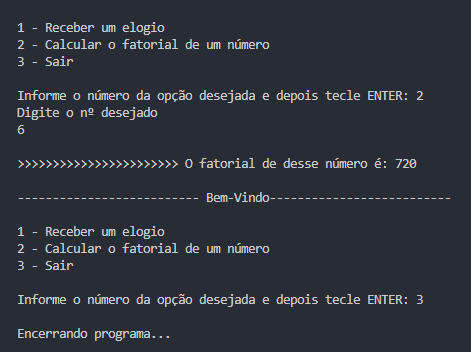

# Realizando projeto

Vamos criar uma estrutura de menus usando o loop while e o if encadeado para dar ao usuário 3 escolhas: receber um elogio, calcular o fatorial de um número ou encerrar a execução do programa.
Nele aplicamos os seguinte conceitos aprendidos nesse capítulo:

- While
- If condicional
- Elif
- Else
- Break
- For in 
- Range
---
