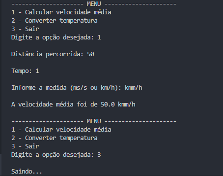

# Enfim funções

Nesse capítulo aprendemos os tipos de funções e como utilizá-las.\
Abordando temas como:
- Função sem parâmetro
- Função com parâmetro
- Função *args
- Função **kwargs
- Função com return  

Como projeto desenvolvemos um script formado ao todo com 4 funções, tendo uma responsável por realizar a chamada das outras 3, e esse script exibe uma tela de menu com 3 opções: calcular velocidade média, converter temperatura e sair. Além disso, também vimos que é possível realizar a chamada de funções por outros arquivos. 

